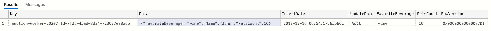

# SQL Server State Store

This is an experimental implementation of a state based on SQL Server. 

## Why SQL Server?

**PROS**

- Operational features: backup, restore
- Database model that might be more appealing to some users in comparison to key/value and/or nosql models
- Rich ecosystem, querying capabilities

**CONS**

- No built to be a key/value store


## Implementation details

Data is stored in a table with the following definition:

```sql
CREATE TABLE [sampleappv3].[users](
	[Key] [nvarchar](200) NOT NULL,
	[Data] [nvarchar](max) NOT NULL,
	[InsertDate] [datetime2](7) NOT NULL,
	[UpdateDate] [datetime2](7) NULL,
	[RowVersion] [timestamp] NOT NULL
) 
```

As you can see the data is saved as text. With SQL Server we can promote properties from JSON to become columns, allowing indexing. For instance, adding favorite beverage and pets count:

```sql
CREATE TABLE [sampleappv3].[users](
	[Key] [nvarchar](200) NOT NULL,
	[Data] [nvarchar](max) NOT NULL,
	[InsertDate] [datetime2](7) NOT NULL,
	[UpdateDate] [datetime2](7) NULL,
	[FavoriteBeverage]  AS (CONVERT([nvarchar](100),json_value([Data],'$.FavoriteBeverage'))) PERSISTED,
	[PetsCount]  AS (CONVERT([int],json_value([Data],'$.PetsCount'))) PERSISTED,
	[RowVersion] [timestamp] NOT NULL
) 
```

The column values will be resolved by SQL Server at insert/update time.

### Key

Using the type `NVARCHAR(200)` as key in some scenarios is not ideal (integers or uuids). The experimental implementation has support for int or uniqueidentifiers as key. The implementation cannot be used yet because the current api is [adding the app.id as the key prefix](https://github.com/dapr/dapr/blob/master/pkg/http/api.go#L345).


### Bulk delete

Bulk delete is performed with the help of this stored procedure:

```sql
CREATE PROCEDURE [sampleappv3].[sp_BulkDelete_users] 
    @itemsToDelete [sampleappv3].users_Table READONLY
AS 
    DELETE [sampleappv3].[users]
    FROM [sampleappv3].[users] x
    JOIN @itemsToDelete i ON i.[Key] = x.[Key] AND (i.[RowVersion] IS NULL OR i.[RowVersion] = x.[RowVersion])
```


### Upsert

Inserts and updates are performed with the following stored procedure:

```sql
CREATE PROCEDURE [sampleappv3].[sp_Upsert_users] (
    @Key 			NVARCHAR(200),
    @Data 			NVARCHAR(MAX),
    @RowVersion 	BINARY(8))
AS
    IF (@RowVersion IS NOT NULL)
    BEGIN
        UPDATE [users]
        SET [Data]=@Data, UpdateDate=GETDATE()
        WHERE [Key]=@Key AND RowVersion = @RowVersion

        RETURN
    END
    
    BEGIN TRY
        INSERT INTO [users] ([Key], [Data]) VALUES (@Key, @Data);
    END TRY

    BEGIN CATCH
        IF ERROR_NUMBER() IN (2601, 2627) 
        UPDATE [users]
        SET [Data]=@Data, UpdateDate=GETDATE()
        WHERE [Key]=@Key AND RowVersion = ISNULL(@RowVersion, RowVersion)
    END CATCH
```

### State declaration

Simplest example:

```yaml
apiVersion: dapr.io/v1alpha1
kind: Component
metadata:
  name: statestore
spec:
  type: state.azure.sqlserver
  metadata:
  - name: connectionString
    value: server=localhost;user id=sa;password=your-password;port=1433;database=dapr_test;
  - name: schema
    value: sampleappv3
  - name: tableName
    value: users
```

Example with property promotions

```yaml
apiVersion: dapr.io/v1alpha1
kind: Component
metadata:
  name: statestore
spec:
  type: state.azure.sqlserver
  metadata:
  - name: connectionString
    value: server=localhost;user id=sa;password=your-password;port=1433;database=dapr_test;
  - name: schema
    value: sampleappv3
  - name: tableName
    value: users
  - name: indexedProperties
    value: '[{ "column":"FavoriteBeverage", "property":"FavoriteBeverage", "type":"nvarchar(100)"}, { "column":"PetsCount", "property":"PetsCount", "type": "INTEGER"}]'
```

With this definition the table would look like this:


### Interesting features/needs further investigation

Features that might be interesting to experiment:

- Using memory optimized tables
- How to migrate different versions (i.e. adding new indexed property)


## Disclaimer

- No stress/load test has been performed